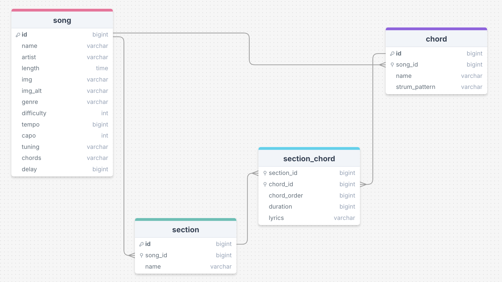

# PlayPal

PlayPal is a fun browser app where you can play along to songs on the guitar, with the chords and lyrics appearing on the screen in sync with the music.

I built this app to help make it easier to be more consistent with playing guitar. I have personally found that consistency is key when introducing a new habit and that it can often be a hassle to find all the information I need when re-visting a previous song that I have learned. With Playpal, all of this information is in one place (chords, strumming pattern, lyrics and section patterns), making it easy to pick up where you left off!

### **Deployed:** https://playpal-guitar.netlify.app/

**Note:** If you are playing a song for the first time upon loading the app, the timings may be slightly off whilst the Heroku server wakes up - please refresh the page and re-select the song, second time's the charm!

## Server Features

This server allows the PlayPal client to retrieve data from the songs/chords to display the chord and lyrics after a song is selected.

All data is stored in a created mySQL database - this includes 4 separate tables, with one many-to-many intermediate table 'section_chord'



The client interacts with the database through an API made with Node and Express.

## Installation

- Clone this repository and the separate client repo [here](https://github.com/isabellainglis/playpal)

- Install all the npm packages for both repos. Go into the project folder and type the following command to install all npm packages:

```bash
  npm install
```

- You will need to create the playpal database locally and populate using the database.sql file (/db/database.sql). **Note:** This project requires root details to be added in the `.env` file.

- Run npm start in both terminals
